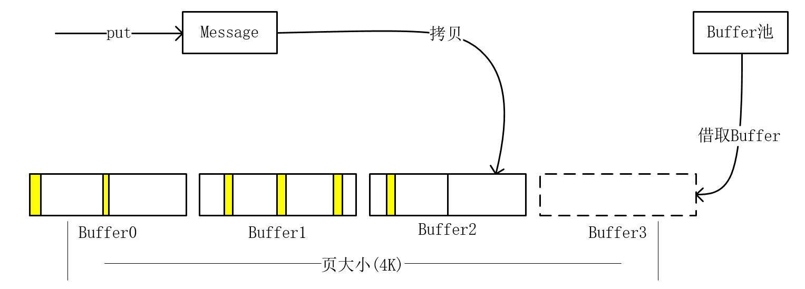
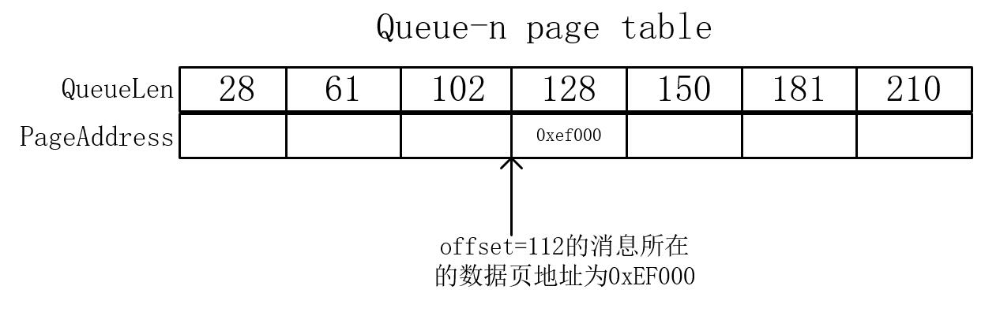

# 比赛攻略
[赛题](https://tianchi.aliyun.com/competition/information.htm?spm=5176.11165320.5678.2.563b57ecdxvY4B&raceId=231657)

## 1 赛题分析与解题思路
首先需要解决索引的问题。因为线上只有8G内存，而消息共有100G大小，故消息只能放到SSD上存储。需要思考该怎样设计索引才能够快速地把消息从SSD上取出来。最快最便捷的方法就是为每条消息都建立一条索引，然而如果这样光是索引就会占了很大的空间，内存放不下，而放硬盘会增多IO次数，这方法是不可取的。故索引的设计有如下的两个原则或目的：

* 尽可能地减少读取消息时所需要进行的IO次数
* 尽可能地减少索引所占用的内存

接着需要决定硬盘读写的方式。会有如下四种：
* 顺序写、随机读
* 随机写、顺序读
* 顺序写、顺序读
* 随机写、随机读

毋庸置疑，顺序写、顺序读的方式是最快的，这样可以最大化硬盘吞吐量。然而内存有限，无法做到整个队列的消息聚合，所以读写都是顺序的方案非常难以实现。因为在第一阶段中，写数据量超级大，而在第三阶段中仅读取10%的数据，如果使用随机写必定会超时，但随机读未必会超时！最终我们选择了顺序写、随机读的方案，并且为每个队列的消息做页聚合。

决定好硬盘读写方式之后，就可以确定好优化方向:

1. 在第一阶段，数据写盘不能停，并且使写盘速度达到最大带宽。
2. 在第二阶段的随机索引中，最大化IOPS，并且尽量不取出多余数据。
3. 在第三阶段中，最大化IOPS，尽可能地预先读取数据，尽量避免阻塞(get)调用者线程。


## 2 数据存储模型
基于以上的分析，并且依照索引设计的原则和目的，我们得出如下的数据存储模型。
使用一个大文件存储数据，消息按页(4K)存储，一页只存一个队列的消息，一个队列存多页。消息的索引方式参考了Kafka存储模型，使用稀疏索引，每个队列在内存中都设置了一个Page Table，其保存消息队列对应使用的页地址和积累队列长度。每条消息存储时会在消息前边加上表示消息长度的消息头。当要检索某条消息时，先在内存中二分查询队列的Page Table得到消息所在页地址，接着把该页数据从硬盘读出来，最后根据消息头表示的长度遍历定位到消息的页内偏移从而读出消息数据。

图1 数据存储模型


## 3 写(put)

图2 消息写总览


有五个关键设计：
* 消息缓冲
* 硬盘写缓冲
* 单线程commit
* 单线程flush
* 直接IO

每一条消息从调用put方法开始到落盘结束共经过了两套缓存。第一套缓存是buffer缓存,目的是把消息积攒成一页大小。第二套缓存是写缓存目的是把多页数据积攒成一个大块数据之后一起写盘。消息积攒成页的过程，是在put方法调用者所在的线程中进行的。当数据积攒成一页大小之后，就会把buffers交给commit线程，由commit线程把buffers数据拷贝到写缓存中。写缓存满了之后,flush线程把写缓存的数据写到硬盘里。

### 3.1 消息缓冲
其目的是把单个队列的消息聚合成一页。操作系统都是按页对齐进行IO的，如果消息没有聚满一页就进行写盘，那么写效率就会变成非常地低，并且可能会增加读取IO次数。为此，我们设计了Buffer池，利用Buffer暂存用户Put过来的消息。Buffer池有如下设计要点：

1. 需要使用Buffer时向Buffer池借取,使用完毕之后归还。
2. 如果取空则阻塞，直到有其它线程归还为止。这样可以防止因Put数据过快而导致OOM。
3. Buffer池尽可能大（当前设置为4.4G）。
4. Buffer尽可能小（当前设置为512字节，一页需要8个）。

对于第3第4点，如果Buffer池过小并且Buffer过大，当数据产生(Put)速度比commit更快，即Buffer的借取速度比归还快很多的时候，Buffer池很容易会取空而阻塞，从而影响写性能。然而，受到内存的限制，Buffer池不能更大。并且，Buffer不能过分小，因为太小的话会增加借取和归还的频度，增加抢锁概率，多占用CPU，影响性能。

图3 利用Buffer进行消息页聚合的过程，消息拷贝到Buffer之前会加上消息头



单队列的消息积攒成一页之后，会把该页消息加入到Commit请求队列。Commit线程接收到请求之后，就会把该页数据拷贝到硬盘的写缓冲中。同时，Commit线程会递增计算得到该页将要写盘的目的页地址，最后把该地址记录到消息队列对应的Page Table中。消息页被拷贝到硬盘写缓冲区之后，其所用的Buffer就会被归还给Buffer池。

Commit线程最大耗时操作是拷贝，并且拷贝速度最大是200M/s(由IO决定)，所以仅需一个就够了，没必要多线程，多线程会徒增抢锁和上下文切换。Commit线程的设计，使得异步写盘得以实现，防止put线程阻塞，为实现最大化写速度打下基础。

图4 页数据commit过程


### 3.2 直接IO (Direct IO)
在介绍硬盘写缓冲之前，先介绍直接IO。使用mmap或者普通的write函数都需要经过page cache。然而在极端的情况下(数据产生比落盘慢,cpu很吃紧)，page cache的页中断所带来的开销是我忍受不了的。故而选择了直接IO方式，绕过page cache，直接把数据落盘。并且，使用直接IO可以让我拥有更多的内存管理权（在这内存极端有限的情况下是必须的），让写缓冲受自己所控，可以以最少的写缓冲实现更高效率的写盘。

### 3.3 硬盘写缓冲
因为使用了直接IO(O_DIRECT)，所以写缓存需要自己管理在此，使用了简单的循环缓冲技术,设置了4个128M的缓冲区。commit线程按顺序地把页数据拷贝到循环缓冲区中。每当一个缓冲区被积满之后，就会把其提交给flush线程，由flush线程进行写盘。因为Flush线程的最大耗时操作就是通知内核发起DMA传输，故线程只设置成单个就够了，多了的话会徒增抢锁和上下文切换。

图5 页数据通过循环缓冲区并进行写盘的过程


## 4 读取
保存消息数据的物理页地址常驻在内存里(page_table)。每当用户需要读取具体某一条消息时,先根据消息的Offset在page_table里找到消息所在的页,接着从硬盘里读取该页内容,最后根据消息头(长度)遍历定位到具体消息。因为是从硬盘上随机读取页，所以性能瓶颈在IOPS上，我们就得往最大化IOPS的方向来设计与实现读取的方案。
读取有四个关键设计：
* 索引表Page Table（稀疏索引）常驻内存。
* 二分查找Page Table，得到页地址。
* 消息读缓存（Read Cache），减少读消息时需要进行的IO次数。
* 预读（Read Ahead）

### 4.1 查询页地址
读取消息之前，需要先把消息所在页的数据读到内存里。通过消息索引(offset)二分查找消息队列对应的page table可以得到消息所在页地址。

图6 页地址查询过程



### 4.2 读取页数据
当查询得到页地址之后，就开始获取页数据。而每次获取页数据都会优先从Read Cache上取出数据页，不会进行IO。如果没有命中Read Cache，则会从文件映射区(mmap)取出数据页，但此时可能会进行IO而阻塞线程。页读取的具体过程会涉及到与预读线程协调同步，其逻辑比较复杂，在介绍完预读之后再提供流程图。

图7 数据页读取过程


### 4.3 定位消息所在页内偏移
把消息所在页数据读取到内存之后，根据消息头（消息长度字段）遍历定位消息所在的页内偏移，即可读出消息。因为在读取阶段，主要瓶颈在IO上，而CPU是很充裕的。因此从一页数据中顺序遍历定位出消息的页内偏移所耗的CPU和时间对于整体的性能影响并没有多大。逻辑很简单，直接上代码：

```cpp
u_int64_t MessageQueue::locate_msg_offset_in_page(void *page_start_ptr, u_int64_t msg_no) {
    u_int64_t  offset = 0;

    for (int i = 0;i < msg_no;i++) {
        unsigned short msg_size = bytesToShort((unsigned char *) (page_start_ptr + offset), 0);
        offset += (msg_size + MSG_HEAD_SIZE);
    }

    return offset;
}
```

### 4.4 预读
在短时间之内多次顺序读取同一个队列的消息，就会触发预读。预读可以减少(get)调用者因需要进行IO而导致的线程阻塞，并能最大化IOPS。因为要自己实现预读，所以有必要关闭操作系统的page cache预读算法（madvise()函数设置）。

预读的操作由read_ahead_service负责。每当读完一页的消息，发现read_cache(预读页)少于或等于一页，则会向read_ahead_service发起下来几页的预读请求.read_ahead_service接收到预读请求之后，把 需要预读的页读到内存，并且push到read_cache队列，用户下一次调用get方法时，首先遍历read_cache队列，若不命中页则把read_cache释放，若命中则读取页内容。如果没有命中read_cache，则通过mapped页来读取数据。因为虽然数据是按顺序写盘的，但是队列的页并不是按顺序存的(哪个队列积满一页，哪个队列就可先落盘)，所以读数据时，就得在硬盘上随机读取页，故读的性能瓶颈在iops上。为了达到最高的iops，应该把预读的线程数量设置大一点(当前设置为128个)。还有一个需要特别注意的是，当预读处理正在进行的时候，只要read_cache队列不是空，用户调用get方法时，还是可以先去遍历read_cache队列的。当read_cache队列为空,并且有预读请求正在进行，才会在用户调用get方法时线程被阻塞，read_cache队列一有数据即可继续运行。

图8 预读概览


图9 页读取流程图


## 5 优势与创新点
* 消息页聚合。
* 支持4K以下任意长度消息存储。
* 设计Buffer池，并支持借取阻塞，防止put数据过快而导致OOM。
* 细化Buffer池，尽可能减少借取阻塞。
* 异步单线程commit，单线程写盘，减少上下文切换和锁的争抢。
* 使用Direct IO，绕过操作系统Page Cache，自实现写缓存，减少页中断，最大化写速度。
* 使用稀疏索引，百万队列索引只占几百兆内存。
* 读取每条消息最多只需进行一次IO。
* 使用消息读缓存，尽可能地较少get方法调用线程的阻塞时间。
* 关闭操作系统的预读，自实现预读，并且get消息线程和预读线程可以同时进行，只有在做链入和取出操作时才抢read cache队列锁，最大化IOPS。

## 6 总结与感想
复赛让我重新复习了一遍数据结构和操作系统，它所考验的知识是非常地基础又是非常地广！也让我体验到了Java的不足和C++的彪悍，让我意识到了双修的必要性。让我感受到设计决定高度，细节决定成败！
